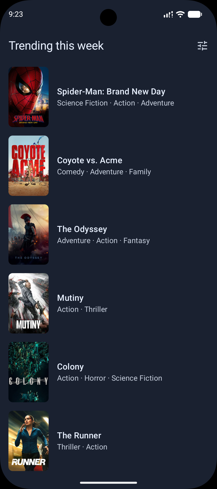
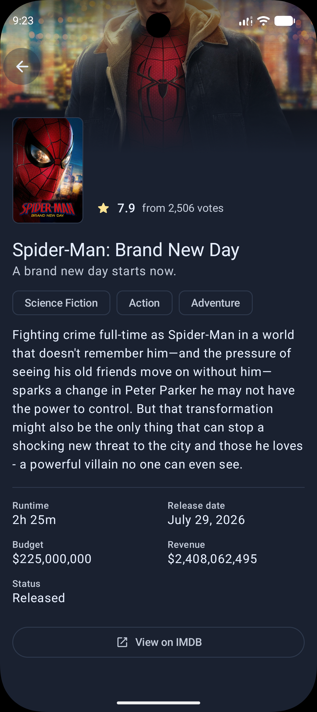
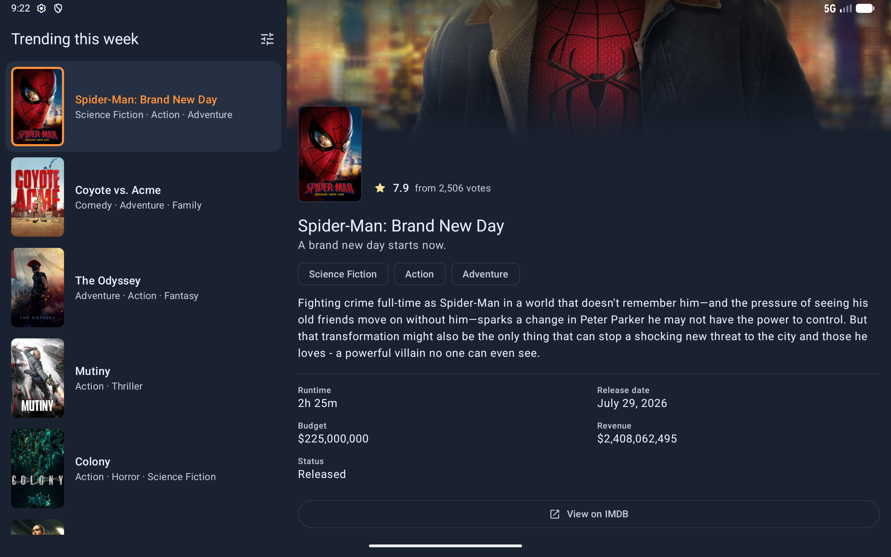

# AMRO

A native Android app for discovering movies, built on the TMDB API.

Two screens: a **trending list** of this week's top 100 movies, with filter and sort functionality,
and a **movie detail** screen behind each of them. On a wide window the two show side by side.

The app is **local-first**. Every screen reads from a Room database, the network fills the database, so the app stays usable when offline (only for the data that is fetched already).

|                        Trending                        |                              Detail                              |
|:------------------------------------------------------:|:----------------------------------------------------------------:|
|  |  |

|               Tablet                                        |
|:-----------------------------------------------------------:|
|  |

## Tech stack

| Area        | Choice                                                                                    |
|-------------|-------------------------------------------------------------------------------------------|
| Language    | Kotlin 2.4                                                                                |
| SDK         | compileSdk 37, targetSdk 37, minSdk 26                                                    |
| Build       | AGP 9, Gradle 9, version catalog, `build-logic` convention plugins                        |
| UI          | Jetpack Compose, Material 3                                                               |
| Navigation  | Jetpack Navigation 3, adaptive list-detail scene                                          |
| DI          | Hilt                                                                                      |
| Async       | Coroutines, Flow                                                                          |
| Networking  | Ktor client on OkHttp                                                                     |
| Storage     | Room                                                                                      |
| Image Loader      | Coil                                                                                      |
| Testing     | JUnit4, Robolectric, Turbine, Compose testing, Compose Preview Screenshot Testing, Kover  |
| Formatting  | Spotless with ktlint                                                                      |
| Release shrinking | R8                                                                                        |

## Getting started

### Get a TMDB token

1. Create an account at [themoviedb.org](https://www.themoviedb.org/signup).
2. Go to **Settings → API** and request an API key. Answer the form: personal / educational use is
   accepted.
3. On that same page, copy the **API Read Access Token**, the long JWT-looking string. Not the
   shorter API key beside it.

The app calls TMDB's v3 endpoints and sends that token in an `Authorization: Bearer` header.
The credential never enters a URL, so it cannot leak through logs, crash reports or proxy history.

### Set it

```bash
cp local.properties.example local.properties
```

Then fill in your token:

```properties
tmdb.readAccessToken=<your API Read Access Token>
```

`local.properties` is not in the Git repository. CI reads the `TMDB_READ_ACCESS_TOKEN` environment
variable instead.

Without a token the project still builds and runs, but requests will fail.

### Run it

```bash
./gradlew :app:installDebug
```

## Architecture

Google's official guidance, feature-modularized. A UI layer over a data layer, unidirectional data
flow, Room as the single source of truth, and repositories as the only entry to data. A feature is a
module, and none depends on another.

More info: [docs/architecture.md](docs/architecture.md).

## Testing

Five layers: unit, screenshot, screen, flow, end-to-end tests.
Fakes and real objects only, no mocking library.

More info: [docs/testing.md](docs/testing.md).

## Design system

The project uses a design system: Material 3, dark and light themes, with tokens and a component catalog in `:core:ui`. Every
feature builds its screens using the design system.

More info: [docs/design-system.md](docs/design-system.md).

## Scripts

| Script                      | Runs                                                          |
|-----------------------------|---------------------------------------------------------------|
| `scripts/unittest.sh`       | Unit tests, screen tests, screenshot goldens, ktlint          |
| `scripts/screenshotTest.sh` | screenshot goldens alone                                      |
| `scripts/screenshotUpdate.sh` | Re-records the goldens                                        |
| `scripts/flowTests.sh`      | device tests, with a fake remote source.                      |
| `scripts/e2e.sh`            | device tests that reach the live API.                         |
| `scripts/coverage.sh`       | Kover test coverage                                           |
| `scripts/format.sh`         | Format using Spotless with ktlint.                            |
| `scripts/clear-data.sh`     | Wipes the installed app's storage on the connected device     |

## CI

[`.github/workflows/ci.yml`](.github/workflows/ci.yml), on every pull request and every push to
`main`, in two parallel jobs:

| Job | Runs                                                                                                                                                                                            |
|---|-------------------------------------------------------------------------------------------------------------------------------------------------------------------------------------------------|
| **Build and Test** | `scripts/unittest.sh`, so unit tests, screen tests, screenshot goldens and the ktlint gate, then `scripts/coverage.sh`. The TMDB token comes from a repository secret (for the live genre test) |
| **Flow tests** | `scripts/flowTests.sh` on an API 34 emulator with hardware acceleration enabled                                                                                                                 |

## More

- [Movie API sources](docs/movie-api-sources.md): how TMDB is abstracted, what the app owns and how to add a second source.
- [Adding a module](docs/adding-a-module.md): the convention plugins in `build-logic` and what each one
  does.
- [Scaling](docs/scaling.md): what changes when we decide to scale.
