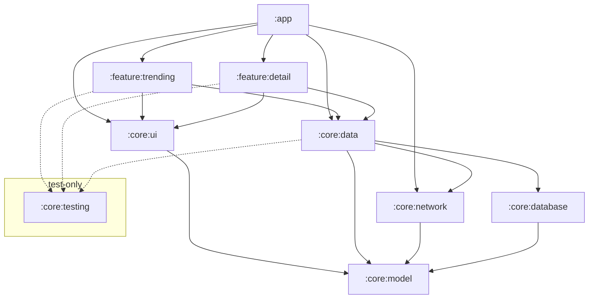
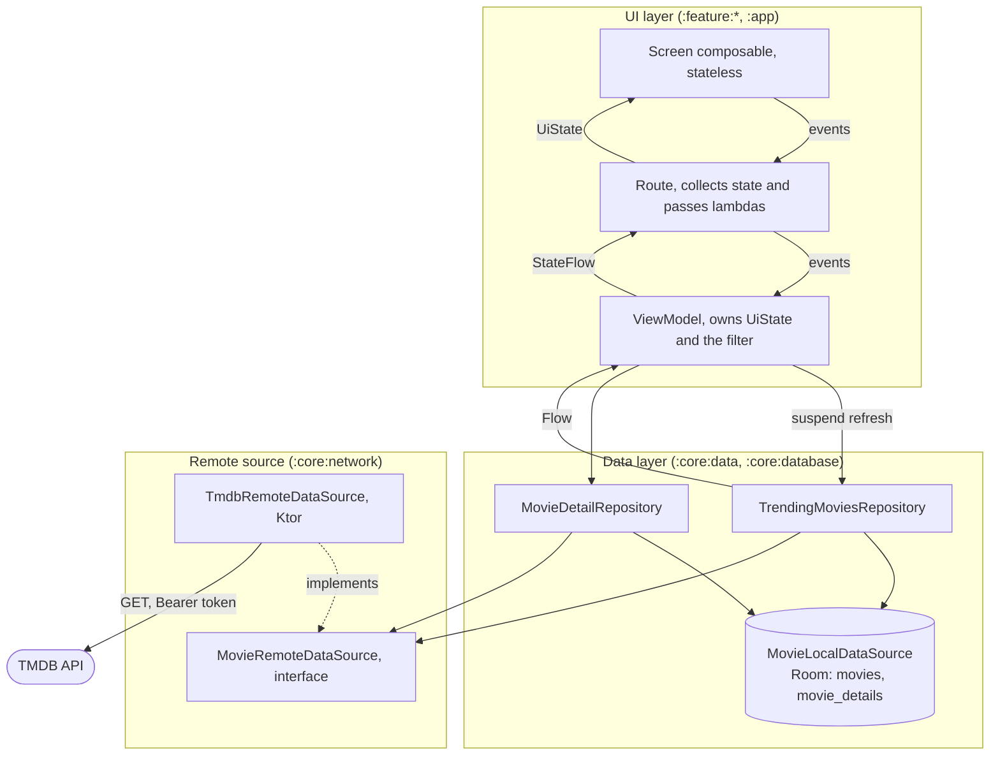
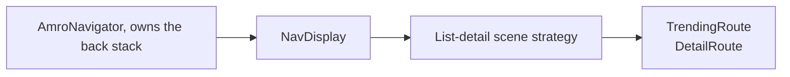

# Architecture

An overview of how the app is put together: what the modules are, what each one holds, and how data
and events move between them.

The app has no backend of its own. TMDB is the only remote, reached with a read access token, and
everything the app shows is served from a local database that the network layer fills. Offline is
not a mode the app enters: it is what a failed request means.

## Modules

> Mermaid diagrams do not render in Android Studio. Read this on GitHub or in VS Code.

| Module | Holds                                                                                                                                                                   |
|---|-------------------------------------------------------------------------------------------------------------------------------------------------------------------------|
| `:core:model` | The types every other module speaks in. Types only, pure Kotlin, no Android dependency                                                                                  |
| `:core:network` | `MovieRemoteDataSource`, the api-neutral contract the data layer depends on, and its TMDB implementation: Ktor client configuration, endpoints, wire DTOs and mappings.
| `:core:database` | The Room database, entities, and DAOs. A movie arrives with its genres already resolved, so nothing here joins them                                                     |
| `:core:data` | Repository interfaces and their implementations, and the fetch policy. Names no source                                                                                  |
| `:core:ui` | Theme, design system tokens and components, generic strings, reusable UI components and helpers                                                                          |
| `:feature:trending` | The trending list, the filter sheet, their view model, and the filter and sort rules it applies over the fetched set                                                    |
| `:feature:detail` | The movie detail screen and its view model                                                                                                                              |
| `:app` | `MainActivity`, the navigator and the `NavDisplay` host, the application class, and the Hilt root                                                                       |
| `:core:testing` | Fakes, fixtures, and test helpers other modules' tests reuse. Never a production dependency                                                                             |

Dependency rules (hard):

- A feature never depends on another feature: navigation between them goes through the `:app` graph.
- The components of `:core:ui` take primitives, so a feature unpacks a model type at the call site.
- `:core:model` depends on nothing and never imports `android.*`.
- `:app` depends on everything. It is the only module that sees every feature.
- Modules speak the domain model language. DTO types never leave `:core:network`, and Room entity types never leave `:core:database`.
- A repository depends on a `MovieRemoteDataSource` interface, never on a named API (ex: TMBD). No API name
  ever leaves `:core:network`.
- `:core:testing` is only a test dependency, never a production one.

## Layers

Two layers, plus a domain layer the project does not currently need. Dependencies point one way.

> Mermaid diagrams do not render in Android Studio. Read this on GitHub or in VS Code.

- **Unidirectional data flow.** State travels one way, from the database through the repository and
  the view model to the screen, and events travel the other as method calls. A screen receives one
  immutable `UiState` and emits lambdas. Every outcome, errors included, is folded into that state,
  so nothing is pushed to the UI through an event channel.
- **Repositories are the sole entry to the data layer.** No view model touches a DAO or a data
  source.
- **A repository speaks to a data source interface.**
- **Room is the single source of truth.** A repository exposes its data as a `Flow` off Room and
  never returns network results directly. The network path only writes. A cached list therefore
  renders before any request completes.
- **Data crossing a layer boundary is immutable**, and mutation happens only inside the owner.

## Navigation and the adaptive layout

`AmroNavigator` owns the back stack, and is the only thing that
mutates it. Features receive lambdas and know nothing about navigation.

> Mermaid diagrams do not render in Android Studio. Read this on GitHub or in VS Code.

One graph plus the scene strategy gives a compact window a stack of screens and an expanded window
two panes, from the same keys: at expanded width both keys resolve into panes that are shown at
once, so selecting a movie replaces the detail pane instead of navigating. Nothing in the graph or
the screens reads the device type or the orientation.
