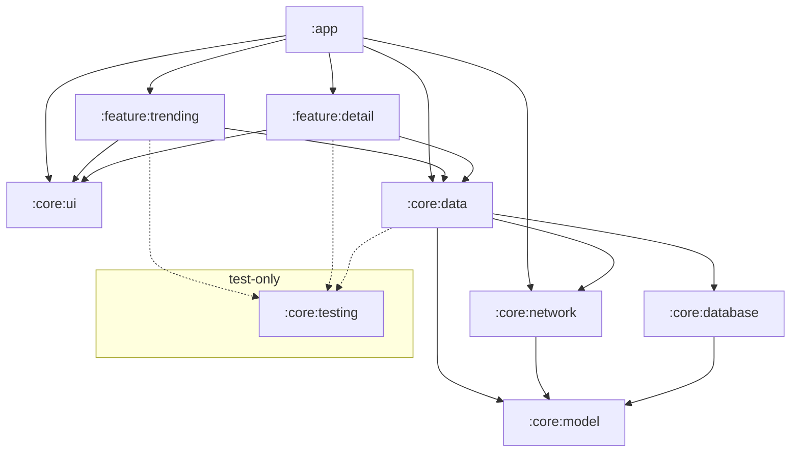

# Architecture

An overview of how the app is put together: what the modules are, what each one holds, and how data
and events move between them.

The app has no backend of its own. TMDB is the only remote, reached with a read access token, and
everything the app shows is served from a local database that the network layer fills. Offline is
not a mode the app enters: it is what a failed request means.

## Modules



| Module | Holds                                                                                                                                                                   |
|---|-------------------------------------------------------------------------------------------------------------------------------------------------------------------------|
| `:core:model` | The types every other module speaks in. Types only, pure Kotlin, no Android dependency                                                                                  |
| `:core:network` | `MovieRemoteDataSource`, the api-neutral contract the data layer depends on, and its TMDB implementation: Ktor client configuration, endpoints, wire DTOs and mappings.
| `:core:database` | The Room database, entities, and DAOs. A movie arrives with its genres already resolved, so nothing here joins them                                                     |
| `:core:data` | Repository interfaces and their implementations, and the fetch policy. Names no source                                                                                  |
| `:core:ui` | Theme, design system tokens and components, and generic strings. Depends on nothing in the project                                                                      |
| `:feature:trending` | The trending list, the filter sheet, their view model, and the filter and sort rules it applies over the fetched set                                                    |
| `:feature:detail` | The movie detail screen and its view model                                                                                                                              |
| `:app` | `MainActivity`, the navigator and the `NavDisplay` host, the application class, and the Hilt root                                                                       |
| `:core:testing` | Fakes, fixtures, and the resource-reading helper other modules' tests reuse. Never a production dependency                                                              |

Dependency rules (hard):

- A feature depends on `:core:data` and `:core:ui` only. Never feature to feature: navigation between
  them goes through the `:app` graph.
- `:core:ui` depends on nothing in the project. Its components take primitives, so a feature unpacks
  a model type at the call site.
- `:core:model` depends on nothing and never imports `android.*`.
- `:app` depends on everything. It is the only module that sees every feature.
- Ktor types never leave `:core:network`, and Room types never leave `:core:database`. A repository
  returns model types or a `DataError`, so no layer above the data layer knows which library
  produced a value.
- A repository depends on a `MovieRemoteDataSource` interface, never on a named API (ex: TMBD). No API name
  appears above `:core:network`.
- No user-facing copy below the UI layer. The data layer returns typed errors, and a feature maps
  each one to a string resource it owns. The test is whether a translator would ever touch the
  string.
- `:core:testing` is only ever a test dependency, never a production one.

## Layers

Two layers, plus a domain layer the project does not currently need. Dependencies point one way.


- **Unidirectional data flow.** State travels one way, from the database through the repository and
  the view model to the screen, and events travel the other as method calls. A screen receives one
  immutable `UiState` and emits lambdas. Every outcome, errors included, is folded into that state,
  so nothing is pushed to the UI through an event channel.
- **Repositories are the sole entry to the data layer.** No view model touches a DAO or a data
  source.
- **A repository speaks to a data source interface.**
- **Room is the single source of truth.** A repository exposes its data as a `Flow` off Room and
  never returns network results directly. The network path only writes. A cached list therefore
  renders before any request completes.
- **Data crossing a layer boundary is immutable**, and mutation happens only inside the owner.


## What the mapper normalises (TODO: remove this)

TMDB says "no value" three ways: a zero, an empty string, and a missing field. The mapper in
`:core:network` turns all three into `null`, so a budget of zero arrives as no budget. Nothing above
the data layer checks for sentinel values.

The same mapper turns an image path into an `ImageRef`: the available widths and the URL for each.
`:core:ui` picks a width from its layout constraints, which is why the URL cannot be chosen earlier,
and TMDB's host and width list stay in `:core:network`.

## Loading the trending list (TODO: remove this)

`TrendingMoviesRepository` asks the source for a hundred distinct movies, once, and writes what comes
back. The walk, the deduplication by movie id and the page cap are the source's own, exercised by
an assembled fixture that repeats rows across a page boundary, so the duplicates unstable ranking
produces are reproduced on every run rather than by a live API.

A request that fails part way through fails the whole call, and the source returns no movies with it.
A short list and a list cut short look the same to a caller, so a partial answer would reach the
screen as though it were the whole one. The screen shows the failure with a retry instead.

A refresh replaces the trending table in one transaction. Room defers invalidation until the commit,
so a subscriber sees one emission carrying the new set and never an empty list between the delete and
the insert.

## Detail (TODO: remove this)

`MovieDetailRepository` exposes a `Flow` of the cached detail and a separate call that fetches. The
fetch is issued whatever the cache holds, so neither table is timestamped and no layer holds a clock:
the cache renders at once and is replaced when an answer arrives.

The two carry different failures on purpose. A fetch for a movie with nothing cached is the screen's
own request, and its failure is the screen's error state. A fetch behind content that is already
correct reports nothing, and is attempted again the next time the movie is opened.

## Genres (TODO: remove this)

`Genre` is the app's own vocabulary, not a provider's, and a movie stores app genres. One selection
in the filter sheet therefore matches movies from every source at once.

Each source keeps an alias table, its own genres paired with the app genre each one becomes, and the
translation happens while a movie is saved. The alias is keyed on the provider's id where it has
one, because an id survives a rename and a name does not. TMDB numbers its 19 genres; a provider
like TVmaze ships bare strings and can only be keyed on those.

Matching by name alone does not get far. Comparing those two lists, 15 names match exactly and
normalising case and punctuation buys one more, because one writes "Science Fiction" and the other
"Science-Fiction". The rest are not spellings but different vocabularies: one has a single
Documentary where the other has Nature, Food, Travel and DIY. Each alias is a decision, not a
lookup.

A genre that maps to nothing is dropped, so every chip on a screen is one the filter sheet can also
offer and the two never disagree about which genres exist. The movie shows fewer genres than the
provider gave it, and nothing on screen says so.

Because the translation happens on write, a movie already in the database keeps the answer it was
given. Correcting an alias or adding a missing one takes effect for a cached movie only when it is
fetched again.

A test asserts that every genre in a source's recorded list has an alias. That proves the mapping is
total over what we have recorded, so a gap cannot be introduced by editing it. It does not detect a
provider adding a genre: the fixture still holds the old list, and the addition surfaces when the
fixture is next recorded.

## Adding a second source (TODO: move to readme)

A source is a package under `:core:network`'s `sources/`, beside the TMDB one it already holds: a
client configuration, wire shapes, mappers, a mapping from that provider's genres onto the app's, and
a Hilt module that binds it. The module root holds only the contract and what every source shares, so
no new Gradle module is needed and no existing file is edited.

Nothing in the UI, the repositories, or the database schema changes either, because a movie already
carries which source issued it, its genres are already the app's own, its images already arrive as a
set of URLs rather than a path, and the fetch policy already asks for pages without knowing how large
one is.

Each source contributes itself through a Hilt multibinding, so the repository takes every source
there is rather than a named one:

```kotlin
@Binds @IntoSet abstract fun bindTmdb(impl: TmdbRemoteDataSource): MovieRemoteDataSource

class DefaultTrendingMoviesRepository @Inject constructor(
    private val sources: Set<@JvmSuppressWildcards MovieRemoteDataSource>,
)
```

`@JvmSuppressWildcards` is required: Kotlin compiles the parameter to `Set<? extends
MovieRemoteDataSource>`, which Dagger does not match against the binding.

While there is one source the repository takes a single `MovieRemoteDataSource` and the binding is a
plain `@Binds`. The set is what the second source turns it into.

Three things are not paid for, deliberately:

- **What a second source means.** Merging two trending lists, preferring one, or showing them apart
  is a product decision. The data layer can express any of them; none is chosen.
- **Cross-source identity.** Deduplication is by `MovieId`, which is a source and that source's id,
  so one film served by two providers is two rows. Matching them needs a rule of its own, on
  `imdb_id` where both carry one and on title and year otherwise.
- **Comparable popularity.** Each provider scores on its own scale, so a merged list cannot be
  ordered by popularity without a normalisation. Title and release date order fine across sources.

## Navigation and the adaptive layout

`AmroNavigator` owns the back stack, a `SnapshotStateList` of typed keys, and is the only thing that
mutates it. Features receive lambdas and know nothing about navigation.


One graph plus the scene strategy gives a compact window a stack of screens and an expanded window
two panes, from the same keys: at expanded width both keys resolve into panes that are shown at
once, so selecting a movie replaces the detail pane instead of navigating. Nothing in the graph or
the screens reads the device type or the orientation.
