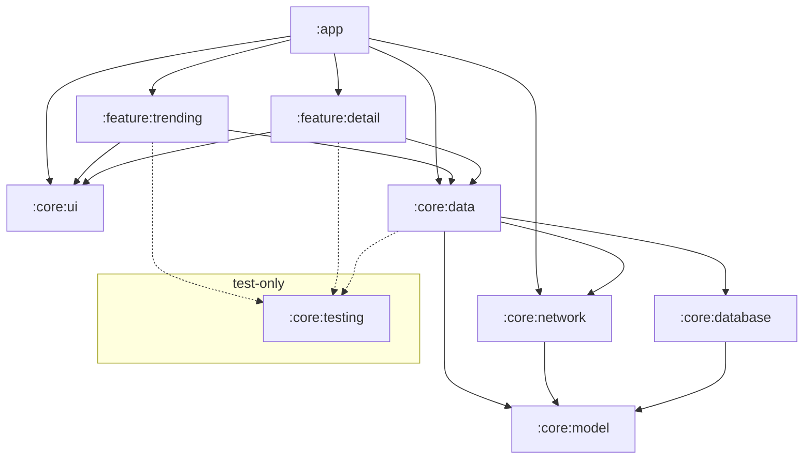
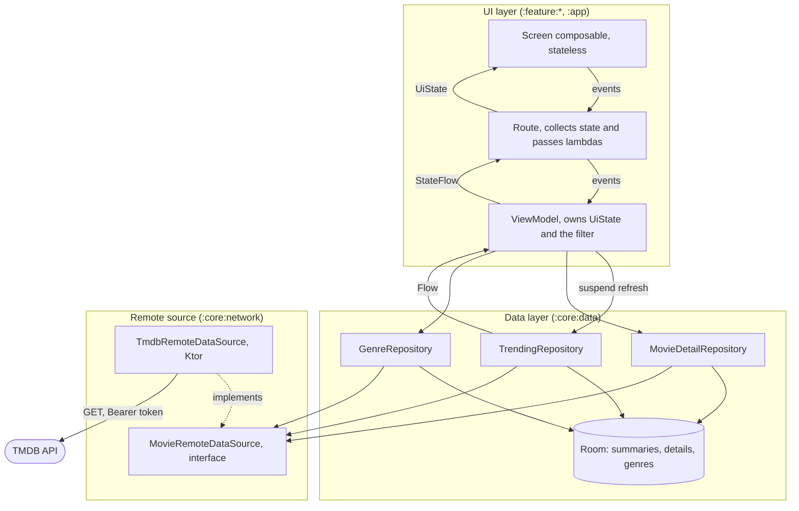
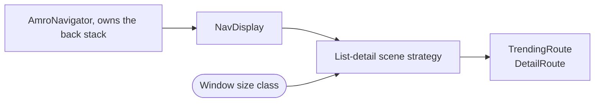

# Architecture

An overview of how the app is put together: what the modules are, what each one holds, and how data
and events move between them.

The app has no backend of its own. TMDB is the only remote, reached with a read access token, and
everything the app shows is served from a local database that the network layer fills. Offline is
not a mode the app enters: it is what a failed request means.

## Modules

| Module | Holds |
|---|---|
| `:core:model` | The types every other module speaks in: `MovieId`, `Movie`, `MovieDetail`, `Genre`, `MovieFilter`, `SortKey`, `SortDirection`, `ImageRef`, and the sealed `DataError`. Types only, pure Kotlin, no Android dependency |
| `:core:network` | `MovieRemoteDataSource`, the source-neutral contract the data layer depends on, and its TMDB implementation: Ktor client configuration, endpoints, wire DTOs, DTO to model mapping, the mapping of transport and status failures onto `DataError`, and the mapping of TMDB's genres onto the app's own. Also TMDB's own facts, its page size and the instability of its ranking |
| `:core:database` | The Room database, entities, DAOs, the genre alias table, and the relation query that returns a movie with its genres |
| `:core:data` | Repository interfaces and their implementations, the fetch policy, deduplication, the freshness rule, and the filter and sort functions the trending list applies. Names no source |
| `:core:ui` | Theme, design system tokens and components, and generic strings. Depends on nothing in the project |
| `:feature:trending` | The trending list, the filter sheet, and their view model |
| `:feature:detail` | The movie detail screen and its view model |
| `:app` | `MainActivity`, the navigator and the `NavDisplay` host, the application class, and the Hilt root |
| `:core:testing` | Fakes, fixtures, and the resource-reading helper other modules' tests reuse. Never a production dependency |

Dependency rules (hard):

- A feature depends on `:core:data` and `:core:ui` only. Never feature to feature: navigation between
  them goes through the `:app` graph.
- `:core:ui` depends on nothing in the project. Its components take primitives, so a feature unpacks
  a model type at the call site.
- `:core:model` depends on nothing and never imports `android.*`.
- `:app` depends on everything. It is the only module that sees every feature.
- Ktor types never leave `:core:network`, and Room types never leave `:core:database`. A repository
  returns model types or a `DataError`, so no layer above the data layer knows which library
  produced a value.
- A repository depends on `MovieRemoteDataSource`, never on a named source. No provider's name
  appears above `:core:network`.
- No user-facing copy below the UI layer. The data layer returns typed errors, and a feature maps
  each one to a string resource it owns. The test is whether a translator would ever touch the
  string.
- `:core:testing` is only ever a test dependency, never a production one.

## Layers

Two layers, plus a domain layer the project does not currently need. Dependencies point one way.

- **Unidirectional data flow.** State travels one way, from the database through the repository and
  the view model to the screen, and events travel the other as method calls. A screen receives one
  immutable `UiState` and emits lambdas. Every outcome, errors included, is folded into that state,
  so nothing is pushed to the UI through an event channel.
- **Repositories are the sole entry to the data layer.** No view model touches a DAO or a data
  source.
- **A repository speaks to a data source interface.** It decides how many pages to ask for and when
  to stop; the source knows how one page is requested and how large it is. That split is what keeps
  the fetch policy free of any provider's pagination.
- **A movie is identified by its source and that source's id.** One source today, so the pair is
  always the same on the left, but the id space belongs to whoever issued it, and a second source
  reusing an integer must not collide with the first.
- **Room is the single source of truth.** A repository exposes its data as a `Flow` off Room and
  never returns network results directly. The network path only writes. A cached list therefore
  renders before any request completes, and a refresh that changes nothing changes nothing on
  screen, because the list is keyed by movie id.
- **Data crossing a layer boundary is immutable**, and mutation happens only inside the owner.

## What the mapper normalises (TODO: remove this)

TMDB says "no value" three ways: a zero, an empty string, and a missing field. The mapper in
`:core:network` turns all three into `null`, so a budget of zero arrives as no budget. Nothing above
the data layer checks for sentinel values.

The same mapper turns an image path into an `ImageRef`: the available widths and the URL for each.
`:core:ui` picks a width from its layout constraints, which is why the URL cannot be chosen earlier,
and TMDB's host and width list stay in `:core:network`.

## Loading the trending list (TODO: remove this)

`TrendingRepository` owns the whole fetch. It requests pages in order, maps each response to model
types, and stops when it holds enough distinct movies or reaches the request cap. Deduplication by
movie id is a pure function taking the accumulated pages and returning distinct movies, so the
duplicates that unstable ranking produces are reproduced by a fixture rather than by a live API.

A request that fails part way through keeps the pages that already succeeded: the repository writes
what it has and returns the failure, which is what lets the UI show a short list and name it as
incomplete rather than discarding it.

The genre list is fetched once and stored. The join from ids to names happens in the DAO's relation
query, so a `Movie` carries genre names by the time it leaves the data layer, and the filter sheet
reads the same table.

## Detail and freshness (TODO: remove this)

`MovieDetailRepository` exposes a `Flow` of the cached detail and a separate call that fetches when
the cache is missing or older than the freshness window. The window is a `cachedAt` column compared
against an injected `Clock`, so a test moves time instead of waiting.

The two calls carry different failures on purpose. A fetch for a movie with nothing cached is the
screen's own request, and its failure is the screen's error state. A refetch behind content that is
already correct reports nothing, and is attempted again the next time the movie is opened.

## Genres (TODO: remove this)

`Genre` is the app's own vocabulary, not a provider's, and the stored link between a movie and its
genres holds app genres. One selection in the filter sheet therefore matches movies from every
source at once.

Each source keeps an alias table, its own genres paired with the app genre each one becomes, and the
translation happens while a movie is saved. The alias is keyed on the provider's id where it has
one, because an id survives a rename and a name does not. TMDB numbers its 19 genres; a provider
like TVmaze ships bare strings and can only be keyed on those.

Matching by name alone does not get far. Comparing those two lists, 15 names match exactly and
normalising case and punctuation buys one more, because one writes "Science Fiction" and the other
"Science-Fiction". The rest are not spellings but different vocabularies: one has a single
Documentary where the other has Nature, Food, Travel and DIY. Each alias is a decision, not a
lookup.

A genre that maps to nothing is dropped, so every chip on a screen is one the filter sheet can also
offer and the two never disagree about which genres exist. The movie shows fewer genres than the
provider gave it, and nothing on screen says so.

Because the translation happens on write, a movie already in the database keeps the answer it was
given. Correcting an alias or adding a missing one takes effect for a cached movie only when it is
fetched again.

A test asserts that every genre in a source's recorded list has an alias. That proves the mapping is
total over what we have recorded, so a gap cannot be introduced by editing it. It does not detect a
provider adding a genre: the fixture still holds the old list, and the addition surfaces when the
fixture is next recorded.

## Adding a second source

A source is a module implementing `MovieRemoteDataSource`, a mapping from its genres onto the app's,
and a binding that provides both. Nothing in the UI, the repositories, or the database schema
changes, because a movie already carries which source issued it, its genres are already the app's
own, its images already arrive as a set of URLs rather than a path, and the fetch policy already
asks for pages without knowing how large one is.

One thing is not paid for, deliberately:

- **What a second source means.** Merging two trending lists, preferring one, or showing them apart
  is a product decision. The data layer can express any of them; none is chosen.

## Navigation and the adaptive layout

`AmroNavigator` owns the back stack, a `SnapshotStateList` of typed keys, and is the only thing that
mutates it. Features receive lambdas and know nothing about navigation.

One graph plus the scene strategy gives a compact window a stack of screens and an expanded window
two panes, from the same keys: at expanded width both keys resolve into panes that are shown at
once, so selecting a movie replaces the detail pane instead of navigating. Nothing in the graph or
the screens reads the device type or the orientation.
